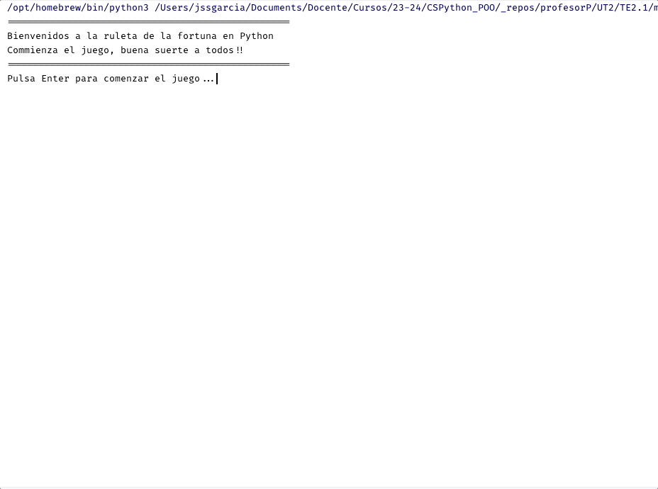
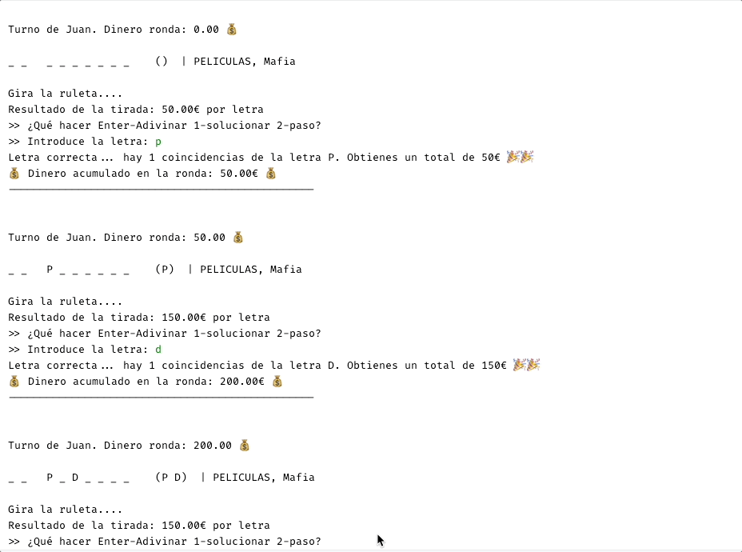
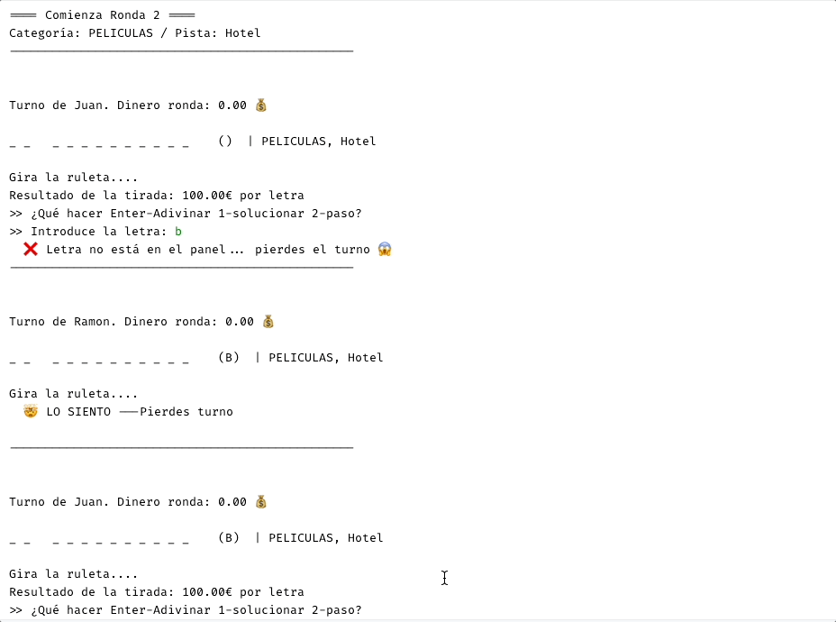
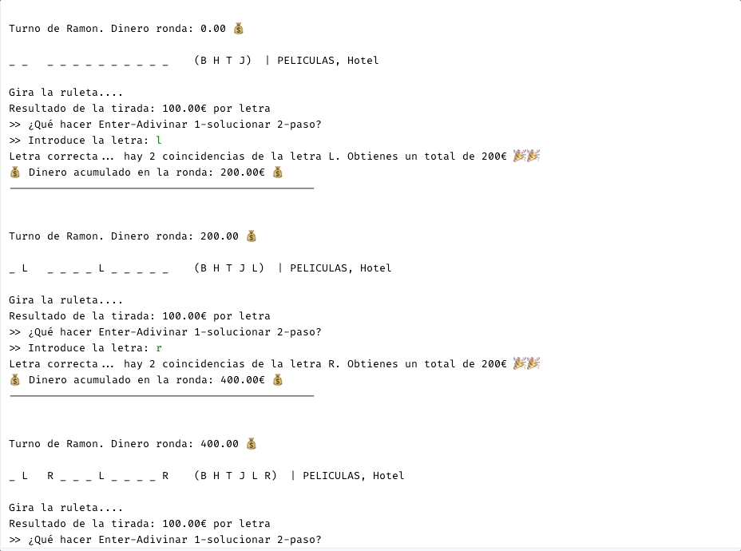

# Tarea Evaluable 2.1. Ruleta de la Fortuna

## Enunciado

El programa debe simular una versión simplificada del juego de la "ruleta de la fortuna".

- Los jugadores pueden ser personas, o el propio ordenador puede ser otro jugador.<br>
  _Cada jugador tiene una cantidad de dinero inicial (0€) que va aumentando o disminuyendo en función de los premios obtenidos_.

- Ganará el jugador que más dinero haya acumulado al final de todas las rondas.
- En cada ronda, el objetivo es **adivinar** una frase oculta, dentro de una categoria. Por ejemplo, "películas", "refranes", etc, con una pista.
- El jugador observa la frase a través de una serie de guiones que representan las letras de la frase. Cada letra está representada por un guión bajo. Por ejemplo, la frase "Hola mundo" se representaría como "\_ \_ \_ \_ _ 〰️ _ \_ \_ \_ \_ \_".
- Durante su turno, cada jugador gira una ruleta para determinar el premio que obtiene.
  - La ruleta tiene 24 casillas, cada una con un premio asociado.
  - Los premios pueden ser positivos o negativos.

<br>

**Durante una tirada del jugador, pueden ocurrir en las siguientes situaciones:**

1. Si la ruleta se detiene en una casilla con dinero, puede hacer una de las siguientes acciones:

   - `Elegir una Vocal` (no elegida ya). La vocal cuesta (250€), si no tiene suficiente dinero, no puede elegir una vocal. `Elegir una consonante` de la frase (no elegida ya), no tiene coste.
   - Si la letra está en la frase:

     - Obtiene una recompensa por cada ocurrencia de la letra en la frase, por ejemplo, si la letra elegida es "a", la casilla tenía un premio de 100€ y la frase es "Hola mundo", el premio sería 200€. El jugador mantiene su turno, si no pasa el turno al siguiente jugador.
     - Si no, el premio es 0 y pasa el turno al siguiente jugador.

   - Adivinar la frase completa, escribiendo la frase.

     - Si la frase es correcta, el jugador gana el premio acumulado.
     - Si la frase es incorrecta, el premio es 0 y pasa el turno al siguiente jugador.

   - Pasar el turno al siguiente jugador, diciendo "Paso"

   - Adivinar una consonante de la frase (no elegida ya). Si la letra está en la frase, el jugador recibe el premio de la ruleta. Si no está, el premio es 0, y pierde el turno, pasando al siguiente jugador.

2. Si la ruleta se detiene en una casilla "Pierde Turno", el jugador pierde el turno y pasa al siguiente jugador.

3. Si la ruleta se detiene en una casilla "Quiebra", el jugador pierde todo su dinero de esta partida, pero mantiene todo el dinero que haya ganado en partidas anteriores.

## Especificaciones

En el desarrollo del juego, hay que aplicar los conocimientos adquiridos en la asignatura de Programación Orientada a Objetos, y en el resto de módulos.

### Objetivos

- Aplicar los conceptos de Programación Orientada a Objetos.
  - Crear clases y objetos.
  - Aplicar conceptos de herencia y polimorfismo.
- Aplicar uso de modulos y paquetes.
- Aplicar conceptos de manejo de excepciones.
- Aplicar conceptos de manejo de ficheros.
- Aplicar conceptos de manejo de listas y diccionarios.

## Guía desarrollo del juego

### Clase `Constantes`

Se creará una clase `Constantes` que contendrá las constantes del juego. Todas las constantes será en mayúsculas, y se accederá a ellas a través de la clase (sin instancia).

- TOTAL_ROUNDS: Número de rondas que se jugarán en el juego.
- VOCAL_PRECIO: Precio de la vocal (250€)
- RECOMPENSA_PANEL: Premio por resolver el panel (500€)
- Resto de constantes que consideres necesarias.

### Clase `Game`

Clase más importante del juego. Gestiona el flujo del juego.

Pasos:

1. Inicio del juego

   - Mostrar bienvenida
   - Preguntar el número de jugadores y sus nombres, así como su tipo (Humano o Computadora)

2. Se juegan tantas rondas/paneles como se haya indicado en la constante TOTAL_ROUNDS.

   - Cada ronda se juega con un panel distinto. (Distinta frase)
   - Al final de cada ronda, se muestra el dinero acumulado de cada jugador.

3. Una vez finalizadas todas las rondas, se muestra el ganador del juego.

Métodos:

- `start()`: Método que inicia el juego. Pregunta el número de jugadores y sus nombres, así como su tipo (Humano o Computadora)
- `showWinner()`: Método que muestra el ganador del juego.

- `loadGame()`: Método que carga la partida de un fichero. (Ampliación).
- `saveGame()`: Método que guarda la partida en un fichero. (Ampliación).

Almacenamiento del juego:

El juego almacena la información en una carpeta llamada ".ruelta_fortuna" en el home del usuario.

- `$HOME/.ruleta_fortuna/etc/phrases.json`: Fichero que contiene las frases, categorias y pistas.
- `$HOME/.ruleta_fortuna/savedgame.json`: Fichero que contiene la información de la partida actual. (Si existe es que hay una partida guardada). Cuando se finaliza el juego, se borra el fichero.

### Player

Debes crear una clase `Player` (abstracta) que represente a un jugador. La clase debe tener los siguientes atributos de instancia:

Atributos:

- `name`: Nombre del jugador (Constructor)
- `prizeMoney`: Dinero acumulado por el jugador
- `prizeMoneyRound`: Dinero acumulado en la ronda actual

Métodos:

- `addMoney(amt)`: Añade dinero (int) dinero al premio acumulado
- `applyBankrupt()`: Establece el premio acumulado a 0 (Qiebra)
- `addPrizeRound(prize)`: Añade el premio a la ronda actual
- `applyWinRound()`: Añade el premio de la ronda actual (sumando la recompensa del panel) al premio acumulado
- `goMove()`: Método abstracto que debe ser implementado por las clases hijas. Devuelve el resultado de la tirada del jugador (Quiebra, PierdeTurno, Pasa,

- Al imprimir el objeto, debe mostrar el nombre del jugador y el premio acumulado. `Ramón: 1000€`

### Clase HumanPlayer

Debes crear una clase `HumanPlayer` que herede de `Player`. Además de tener los atributos y métodos de `Player`, debe tener los siguientes métodos:

Métodos:

- `goMove()`: Implementa el método.

### Clase ComputerPlayer

Un jugador computadora, que hereda de `Player`.

Este jugador siempre elige una consonante aleatoria de la frase, si no ha sido elegida ya. Si tiene suficiente dinero, elige una vocal aleatoria de la frase, si no ha sido elegida ya. Si no, elige "Paso".

Para darle más realismo, poner un tiempo de espera entre sus movimientos, y mostrar un mensaje de "pensando" antes de realizar su movimiento.

### Clase Ruleta

Representa la ruleta del juego, los valores son los premios que se pueden obtener.

Los valores son los siguientes:

```python
[100, 50, 100, 150, 50, 200, 250, 50, 100, 150, 300, -1, 400, 0, 500, 200, 100, 50, 250, 150, 100, 50, 200]
```

Métodos:

- `girar()`: Devuelve un valor aleatorio de la ruleta.

Valores:

- -1: Quiebra o Bancarrota
- 0: Pierde Turno
- Resto_valores: Premio obtenido

### Clase RoundGame

Representa una ronda del juego, concretamente la resolución de un panel.

En cada ronda, se tiene que elegir una nueva frase, con una categoria a preguntar al jugador (Ampliación), sino se elige una frase aleatoria de cualquier categoria.<br>
En caso de que no se use un fichero, se puede usar una lista de frases predefinidas que estén cargadas en el código.

Cuando se finaliza la ronda, puede finalizar con dos resultados:

- Salir del juego: El jugador/es ha decidido salir del juego.
- Ganar la ronda: Uno de los jugadores ha resuelto el panel.

Métodos:

- `playRound()`: Método que se encarga de jugar una ronda.

  - Comienza el jugador siguiente al que ha ganado la ronda anterior
  - El turno va pasando por cada uno de los jugadores, hasta que se resuelva el panel o se decida salir.

- `playTurn()`: Método encargado de gestionar el turno de un jugador. Devuelve True si el jugador ha resuelto el panel, False en caso contrario (turno siguiente jugador)

  - Cada comienzo de turno, se muestra la información de la ronda actual (Turno de, Frase, Dinero y letras ya dichas)

- `loadPanel()`: Método que carga el panel de un fichero. (Ampliación). Devuelve una frase, así como su pista.
- `showInfo()`: Método que muestra la información de la ronda actual (nombre y dinero acumulado por cada jugador)
- `showTurnInfo()`: Método que muestra la información del turno actual (nombre del jugador, dinero acumulado, letras ya dichas, frase oculta)

- `solvePanel()`: Método que gestiona la resolución del panel. Devuelve True si el jugador ha resuelto el panel, False en caso contrario.
- `guessLetter()`: Método que gestiona la elección de una letra por parte del jugador. También agrega el dinero conseguido en la tirada en la ronda. Devuelve True si el jugador ha acertado la letra, False en caso contrario.

## Mejoras

El desarrollo del juego queda abierto a que los alumnos puedan añadir métodos y atributos que consideren necesarios para implementar las ampliaciones que se comentan en el punto de evaluación.

## Evaluación

Se aplicará la siguiente rúbrica para la evaluación de la tarea:

- **(5 ptos)**
  - Aplicación de conceptos
    - Creación de las clases `Constantes`, `Game`, `Player`, `HumanPlayer`, `ComputerPlayer`, `Ruleta`, `RoundGame`
    - Creación de los atributos y métodos de las clases.
    - Correcta aplicación de herencia y polimorfismo.
    - Gestión de excepciones. (En caso de error, muestre un mensaje de error amable al usuario)
  - Funcionamiento:
    - El juego debe funcionar correctamente, sin errores.
    -
- **(1.5 pto)**
  - Uso de modulos y paquetes
    - Un archivo main que importe los modulos necesarios para el juego.
    - El código está organizado en módulos,
    - Uso de paquetes si es necesario.
- **(1 pto)**
  - Se implementa el uso de Jugador Computadora
- **(2 pto)**
  - Las frases, categorias y pistas se leen de un fichero.
- **(0.5 pto)**
  - Se utilizan enumerados en el desarrollo del juego.

Extra (puntos extra):

- **(1 pto)**
  - Se permite guardar la partida en un fichero, y cargarla posteriormente, dando la opción al usuario de continuar la partida o empezar una nueva.

## Funcionamiento del Juego

Comienzo del juego


Evolución (elige vocal, elige consonante, resuelve)


Evolución (letra no encontrada, pierde turno, pasa)


Final


## Anexo

### Fichero de frases

Fichero Pharse.py

```python
import random


class Phrase:
    # Lista frases ruleta de la fortuan
    __phrases = [
        {
            "categoria": "Peliculas",
            "nombre": "Lo que el viento se llevo",
            "pista": ""
        },
        {
            "categoria": "Peliculas",
            "nombre": "El feo, el gorod y el flaco",
            "pista": "Complexión corporal"
        },
        {
            "categoria": "refranes",
            "nombre": "Al que madruga, Dios le ayuda",
            "pista": "Horario"
        },
        {
            "categoria": "refranes",
            "nombre": "Nunca es tarde si la dicha es buena",
            "pista": "Horario"
        },
        {
            "categoria": "refranes",
            "nombre": "Quien siembra vientos, recoge tempestades",
            "pista": "Cultivo"
        },
        {
            "categoria": "refranes",
            "nombre": "Quien mucho abarca, poco aprieta",
            "pista": "ansia"
        },
        {
            "categoria": "refranes",
            "nombre": "A quien madruga, Dios le ayuda",
            "pista": "Horario"
        },
        {
            "categoria": "refranes",
            "nombre": "A caballo regalado, no le mires el dentado",
            "pista": "Regalo"
        },
        {
            "categoria": "refranes",
            "nombre": "A cada cerdo le llega su San Martin",
            "pista": "Destino"
        },
        {
            "categoria": "refranes",
            "nombre": "A Dios rogando y con el mazo dando",
            "pista": "Oración"
        },
        {
            "categoria": "refranes",
            "nombre": "A falta de pan, buenas son tortas",
            "pista": "Alimento"
        },
        {
            "categoria": "peliculas",
            "nombre": "El Padrino",
            "pista": "Mafia"
        },
        {
            "categoria": "peliculas",
            "nombre": "La lista de Schindler",
            "pista": "Nazismo"
        },
        {
            "categoria": "peliculas",
            "nombre": "El señor de los anillos",
            "pista": "Fantasía"
        },
        {
            "categoria": "peliculas",
            "nombre": "El club de la lucha",
            "pista": "Desdoblamiento"
        },
        {
            "categoria": "peliculas",
            "nombre": "El silencio de los corderos",
            "pista": "Asesino"
        },
        {
            "categoria": "peliculas",
            "nombre": "El bueno, el feo y el malo",
            "pista": "Oeste"
        },
        {
            "categoria": "peliculas",
            "nombre": "El resplandor",
            "pista": "Hotel"
        },
        {
            "categoria": "peliculas",
            "nombre": "El club de la lucha",
            "pista": "Desdoblamiento"
        },
        {
            "categoria": "peliculas",
            "nombre": "El silencio de los corderos",
            "pista": "Asesino"
        },
        {
            "categoria": "peliculas",
            "nombre": "El bueno, el feo y el malo",
            "pista": "Oeste"
        },
        {
            "categoria": "frases celebres",
            "nombre": "Darme un punto de apoyo y movere el mundo",
            "pista": "Física"
        },
        {
            "categoria": "frases celebres",
            "nombre": "La ignorancia es la noche de la mente",
            "pista": "Conocimiento"
        },
        {
            "categoria": "frases celebres",
            "nombre": "La vida es sueño",
            "pista": "Filosofía"
        },
        {
            "categoria": "frases celebres",
            "nombre": "La vida es sueño",
            "pista": "Filosofía"
        },
        {
            "categoria": "frases celebres",
            "nombre": "La vida es sueño",
            "pista": "Filosofía"
        },
        {
            "categoria": "frases celebres",
            "nombre": "La vida es sueño",
            "pista": "Filosofía"
        },
        {
            "categoria": "frases celebres",
            "nombre": "La vida es sueño",
            "pista": "Filosofía"
        },
        {
            "categoria": "frases celebres",
            "nombre": "La vida es sueño",
            "pista": "Filosofía"
        },
        {
            "categoria": "frases celebres",
            "nombre": "La vida es sueño",
            "pista": "Filosofía"
        },
        {
            "categoria": "frases celebres",
            "nombre": "La vida es sueño",
            "pista": "Filosofía"
        },
        {
            "categoria": "frases celebres",
            "nombre": "El corazon tiene razones que la razon ignora",
            "pista": "Amor"
        },
        {
            "categoria": "frases celebres",
            "nombre": "Solo sé que no se nada",
            "pista": "Filosofía"
        },
        {
            "categoria": "frases celebres",
            "nombre": "No hay peor sordo que el que no quiere oir",
            "pista": "Sentidos"
        },
        {
            "categoria": "frases celebres",
            "nombre": "La vida no deberia medirse en cantidad sino en calidad",
            "pista": "Vida"
        },
        {
            "categoria": "frases celebres",
            "nombre": "El hombre que mueve montañas comienza apartando piedrecitas",
            "pista": "Paciencia"
        },
        {
            "categoria": "frases celebres",
            "nombre": "Haz el amor y no la guerra",
            "pista": "Amor"
        },
        {
            "categoria": "frases celebres",
            "nombre": "Cada dia sabemos mas y entendemos menos",
            "pista": "Conocimiento"
        },
        {
            "categoria": "frases celebres",
            "nombre": "Si das pescado a un hombre hambriento, le nutres una jornada. Si le enseñas a pescar, le nutrirás toda su vida",
            "pista": "Enseñanza"
        }
    ]

    def __init__(self, categoria: str, nombre: str, pista: str):
        self.categoria = categoria
        self.frase = nombre
        self.pista = pista

    @staticmethod
    def getPhrase(category: str = None) -> 'Phrase':
        """
        Obtiene una frase aleatoria
        :return: Phrase
        """
        solo_categoria = []
        for item in Phrase.__phrases:
            if category is None or "categoria" not in item.keys():
                solo_categoria.append(item)
            elif item["categoria"] == category:
                solo_categoria.append(item)

        entry = random.choice(solo_categoria)

        return Phrase(entry["categoria"], entry["nombre"], entry["pista"])

    @staticmethod
    def requestCategory() -> str:
        category = ""
        while True:
            value = input(" >> Introduce la categoría de la frase (1-pelicula, 2-frases, 3-refranes): ")
            match value:
                case "1":
                    return "peliculas"
                case "2":
                    return "frases celebres"
                case "3":
                    return "refranes"
                case _:
                    print(" ❌ La categoría no es válida. Introduce un número entre (1-3)")
                    continue
```
